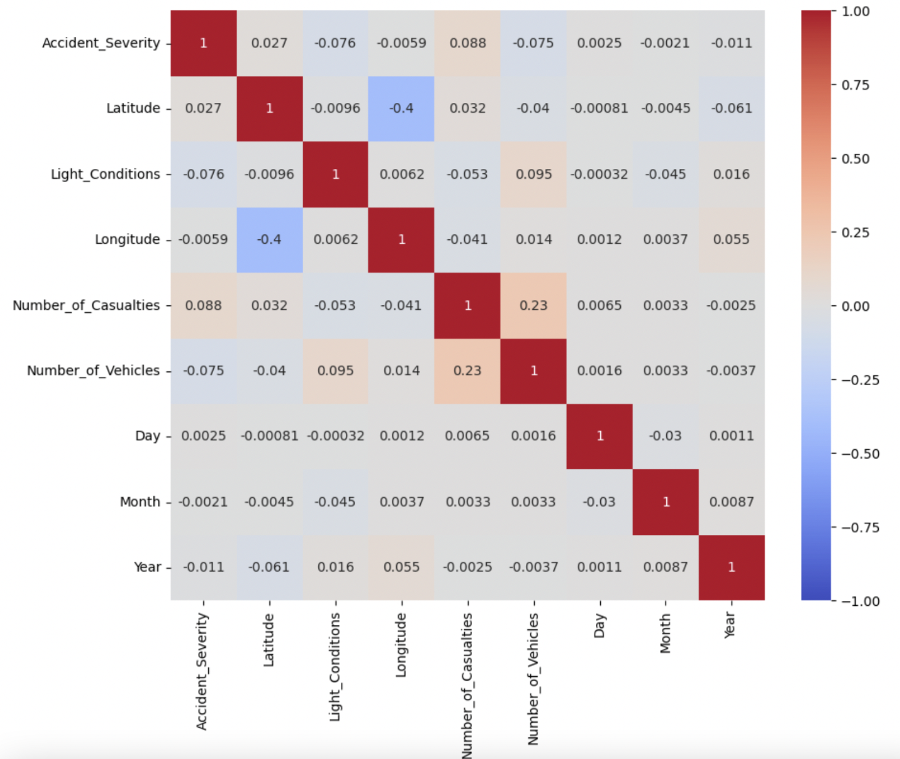
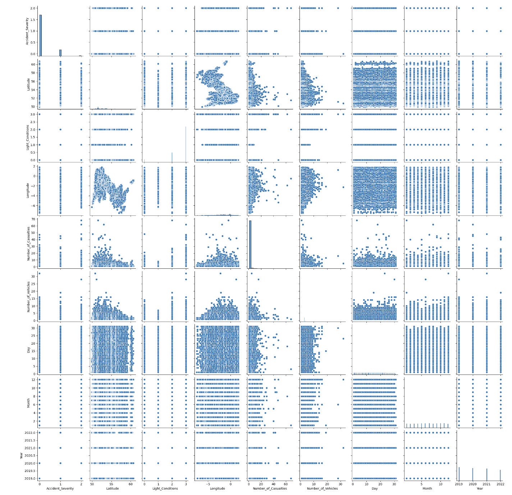
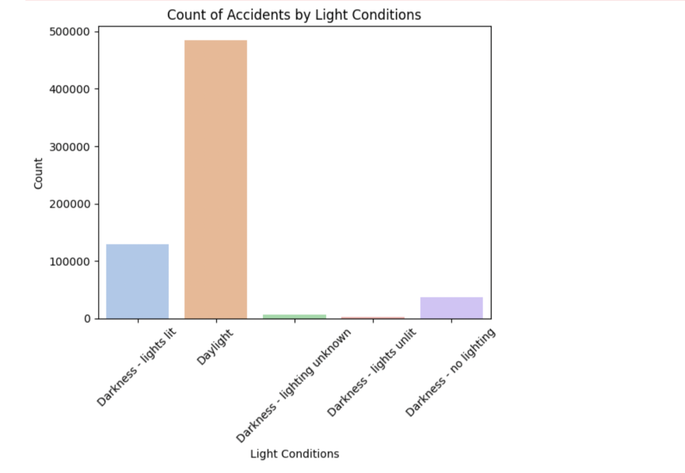
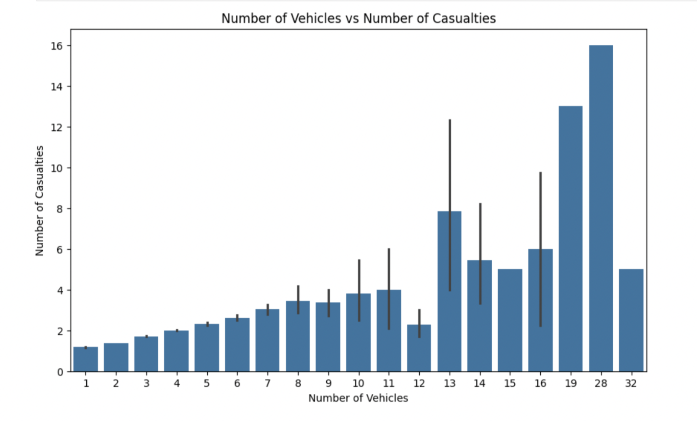
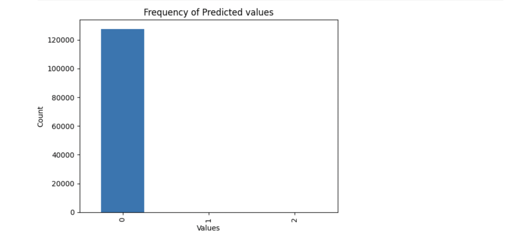
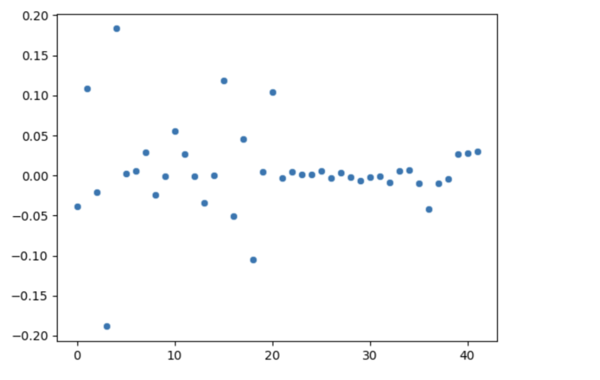

# Members
Arnav Kamdar,
Ishika Agrawal,
Mishka Jethwani,
Yashil Vora,

# Predicting Severity of Road Accidents

### Abstract 
One of the leading causes of non natural death is road accidents. There may be several contributing factors that lead to vehicle casualties, including traffic, weather, road conditions etc. We wanted to predict the severity of road accidents ranging from Slight, Serious, to Fatal using supervised models such as Logistic Regression, Decision Trees etc. Attributes that may be used to predict the data include the road conditions, the weather conditions, vehicle types, or what kind of area they’re in. 

Our data is mainly focused on locations in the UK, so while it may not necessarily apply similarly in the US, we could still use this model to run on US datasets and see the results. It is a dataset with 14 columns and over 600k observations, with columns including severity of accident, the date, number of casualties, longitude/ latitude, road surface conditions, road types, urban/ rural areas, weather conditions, and vehicle types. Ethical concerns include if our stakeholders were vehicle companies, would they have reduced sales if, say, trucks were more likely to lead to severe accidents? However, by figuring out what would predict the severity of road accidents, we can also prevent harm by noting the features that largely impact the severity. 

### Visualization Steps

We made use of the pairplot and heatmap with correlation matrix in order to get an overall sense of the distribution of data. Through this we were also able to get correlations between different features and became one with the data. We were able to see trends and patterns through a few more visualizations of light intensities VS number of accidents, number of casualties VS number of vehicles, and how the number of accidents varied over the past 4 years. 

All of this collectively gave us a better idea of what the data looks like which in turn gives us a better 
idea of which models to use in the next step of this project.

The pair-plot we had plotted is given below. Through this pairplot, we can see the clear relation between latitude and longitude since it maps out the shape of UK.
We can also see a correlation between year and number of casulties, since the number of casualties decreases per year. There also seems to be correlations between the latitude and longitude and the number of casualties/accidents. This could indicate that some regions in UK have more accidents and more work needs to be done there. This could include a lack of traffic signals, poor road safety, or just rash drivers breaking speed limits. 

Next, we plotted a heatmap from which we learned that there is an extremely low correlation between Accident Severity and all other columns. The highest correlations is with Number of Casualties, at 0.088 (which is the most obvious one). However, this doesn't mean that there isn't a connection between our input and output. 

We then plotted different types of graphs to compare and visulaise diffrent aspects of our data. By plotting various graphs, we aimed to gain a deeper understanding of our data and compare different attributes effectively.

1. Accidents by Light Conditions

Intuitively, we would have thought that a lot of accidents happen during the darkness. However, through this barplot, this is false. The maximum number of accidents happen in the daylight. A possible reason for this could be that drivers are more reckless and speed more during when there is daylight, but are more careful in the dark.

2. Accidents over Time
Number of accidents seem to be similar in all the years for similar timings during the year.

4. Number of Vehicles V/S Number of Casualities
Through this, we can see that greater the number of vehicles we have, more the casualties. This is another useful inference which gives us an indication about how the data is correlated.

### Preprocessing Steps

We already began preprocessing the data by one hot encoding most of the categorical data (`Road_Surface_Conditions`, `Road_Type`, `Urban_or_Rural_Area`, `Vehicle_Type`), and for `Light_Conditions`, we chose to make it ordinal and encode it from 0 for Dark, and 3 for Daylight. We selected MultiBinarizer to do multiple one-hot encoding for each row for the `Weather Conditions` as there were multiple categories that were satistified. Then we chose to normalize the `Latitude` and `Longitude` to make it a more contained value. We left the `Number_of_Casualties` and `Number_of_Vehicles` as is, as the values were just integers and seemed to have no large outliers.

#### Milestone 3

Our work for milestone 3 can be found in the notebook `Milestone 3.ipynb` in this repository. Since a link to this was needed as asked in the submission, here is the link to this [notebook](https://github.com/yashilvora19/accident_severity_prediction/blob/main/Milestone%203.ipynb).

#### Standardizing 
We finished up standardizing our data this week. We chose to use standardization as our preprocessing technique due to the following reasons:
1. Our data didn't follow a normal distribution, hence standardizing it was imperative in order to get accurate results.
2. Maining the relationship between datapoints is also important, and since standardization doesn't distort our data distribution, it works well for preprocessing.
3. Standardization also takes into account outliers, which will again make our model better.

### Logistic Regression
In our project, we our trying to classify accidents into the following categories:

1. Mild
2. Severe
3. Fatal

Since this is a classification task, we chose logistic regression as our machine learning model.

Our model analyses the given data (42 columns) and outputs 0 is the accident is classified as 'slight', 1 if it is 'serious', and 2 if it is 'fatal'. We use multiclass logistic regression since there are more than 2 labels. 

We chose logistic regression because of the following reasons:

1. Simplicity: It's easy to implement, and is also one of the first models we learnt in class. 
2. Efficiency: It is known to be a very popular classification model for categorical data, which is what we are focusing on. It is also very fast.
3. Accuracy: It also provides a probability for each outcome, which makes it easier to understand how confident the model is in its predictions.

Further evaluations on the performance of the model have been done within the file labelled `Milestone 3.ipynb`.

The accuracy of our Logistic Regression model, came out to be 85.19%, 85.14% and 85.26% for our Training, Testing and Validation. Other parameters such as recall, precision and support can be seen below in the classification reports.

We also plooted the frequency of our actual and predicted values.

Conclusion: 
Since all 3 accuracies are close to each other (around 85%), and at the same the mean squared error is also close (around 0.18), we can say that there is no major underfitting or overfitting that can be observed.

While this would look like the model is performing well on a surface level, if we take a look at the classification reports and the confusion matrix plotted, we can clearly see that there are definitely issues with this model! The recall scores for classes 1 and 2 (or 'Severe' and 'Fatal') accidents are 0. This means that we are rarely predicting those values and 'Mild' accidents are being predicted the most. It is also worth noting that in our dataset, majority of the accidents our mild and this could result in a bias in the data. Due to this bias, it is reasonable to assume that our logistic regression model is biased too and there can be a lot of improvements that can be made here.

We can see this issue through the graph of the distribution of the data as well- the actual values have majority accidents classified as mild while the predicted values have all of them classified as that.

### Next steps: Other Classification Models

Our next step would be to compare our results from this model to those of other classification models like Neural Networks, Decision Trees, Random Forest, and SVM. By comparing our results, we would get a better understanding of a range of classification models, which would further help us determine which one works the best for our data. 
